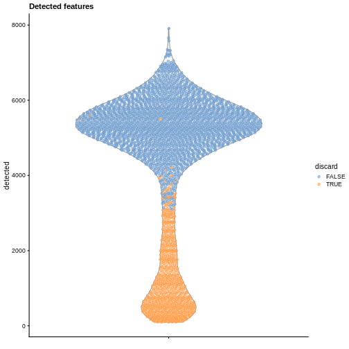
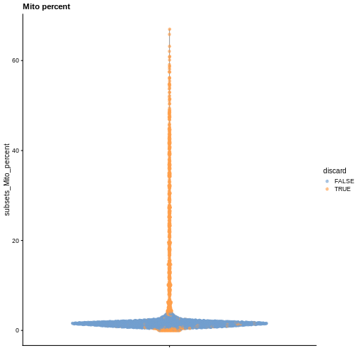
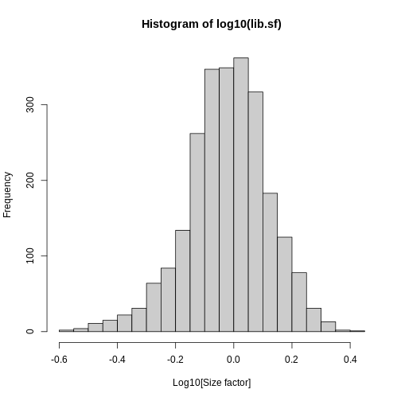
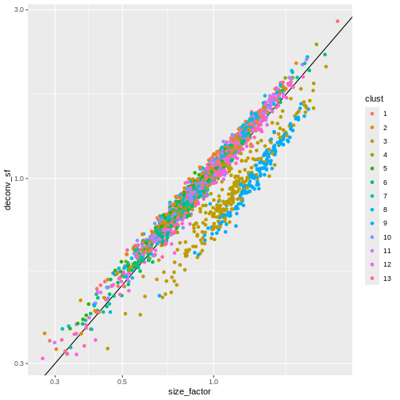
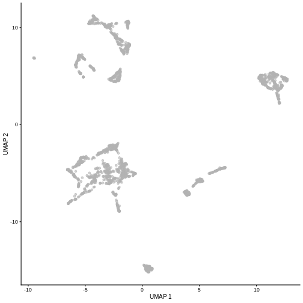
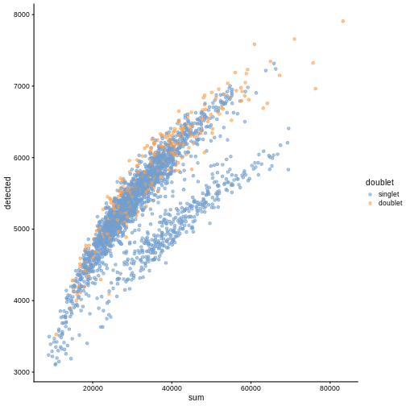

:::::::::::::::::::::::::::::::::::::: questions 

- How do I examine the quality of single-cell data?
- What data visualizations should I use during quality-control in a single-cell analysis?
- How do I prepare single-cell data for analysis?

::::::::::::::::::::::::::::::::::::::::::::::::

::::::::::::::::::::::::::::::::::::: objectives

- Determine and communicate the quality of single-cell data.
- Identify and filter empty droplets and doublets.
- Perform normalization, feature selection, and dimensionality reduction as parts of a typical single-cell analysis pipeline. 

::::::::::::::::::::::::::::::::::::::::::::::::


## Setup and experimental design


As mentioned in the introduction, in this tutorial we will use the wild-type data from the Tal1 chimera experiment. These data are available through the [MouseGastrulationData](https://bioconductor.org/packages/release/data/experiment/html/MouseGastrulationData.html) Bioconductor package, which contains several datasets.

In particular, the package contains the following samples that we will use for the tutorial:

- Sample 5: E8.5 injected cells (tomato positive), pool 3
- Sample 6: E8.5 host cells (tomato negative), pool 3
- Sample 7: E8.5 injected cells (tomato positive), pool 4
- Sample 8: E8.5 host cells (tomato negative), pool 4
- Sample 9: E8.5 injected cells (tomato positive), pool 5
- Sample 10: E8.5 host cells (tomato negative), pool 5

We start our analysis by selecting only sample 5, which contains the injected cells in one biological replicate. We download the "raw" data that contains all the droplets for which we have sequenced reads.


```r
library(MouseGastrulationData)
sce <- WTChimeraData(samples=5, type="raw")
sce <- sce[[1]]
sce
```

```{.output}
class: SingleCellExperiment 
dim: 29453 522554 
metadata(0):
assays(1): counts
rownames(29453): ENSMUSG00000051951 ENSMUSG00000089699 ...
  ENSMUSG00000095742 tomato-td
rowData names(2): ENSEMBL SYMBOL
colnames(522554): AAACCTGAGAAACCAT AAACCTGAGAAACCGC ...
  TTTGTCATCTTTACGT TTTGTCATCTTTCCTC
colData names(0):
reducedDimNames(0):
mainExpName: NULL
altExpNames(0):
```

This is the same data we examined in the previous lesson. 

## Droplet processing

From the experiment, we expect to have only a few thousand cells, while we can see that we have data for more than 500,000 droplets. It is likely that most of these droplets are empty and are capturing only ambient or background RNA.


```r
library(DropletUtils)
bcrank <- barcodeRanks(counts(sce))

# Only showing unique points for plotting speed.
uniq <- !duplicated(bcrank$rank)
plot(bcrank$rank[uniq], bcrank$total[uniq], log="xy",
    xlab="Rank", ylab="Total UMI count", cex.lab=1.2)

abline(h=metadata(bcrank)$inflection, col="darkgreen", lty=2)
abline(h=metadata(bcrank)$knee, col="dodgerblue", lty=2)

legend("bottomleft", legend=c("Inflection", "Knee"), 
        col=c("darkgreen", "dodgerblue"), lty=2, cex=1.2)
```


The distribution of total counts (called the unique molecular identifier or UMI count) exhibits a sharp transition between barcodes with large and small total counts, probably corresponding to cell-containing and empty droplets respectively. 

A simple approach would be to apply a threshold on the total count to only retain those barcodes with large totals. However, this may unnecessarily discard libraries derived from cell types with low RNA content.

### Testing for empty droplets

A better approach is to test whether the expression profile for each cell barcode is significantly different from the ambient RNA pool [@lun2019emptydrops]. Any significant deviation indicates that the barcode corresponds to a cell-containing droplet. This allows us to discriminate between well-sequenced empty droplets and droplets derived from cells with little RNA, both of which would have similar total counts. 

We call cells at a false discovery rate (FDR) of 0.1%, meaning that no more than 0.1% of our called barcodes should be empty droplets on average.


```r
# emptyDrops performs Monte Carlo simulations to compute p-values,
# so we need to set the seed to obtain reproducible results.
set.seed(100)

# this may take a few minutes
e.out <- emptyDrops(counts(sce))

summary(e.out$FDR <= 0.001)
```

```{.output}
   Mode   FALSE    TRUE    NA's 
logical    6184    3131  513239 
```

```r
sce <- sce[,which(e.out$FDR <= 0.001)]
sce
```

```{.output}
class: SingleCellExperiment 
dim: 29453 3131 
metadata(0):
assays(1): counts
rownames(29453): ENSMUSG00000051951 ENSMUSG00000089699 ...
  ENSMUSG00000095742 tomato-td
rowData names(2): ENSEMBL SYMBOL
colnames(3131): AAACCTGAGACTGTAA AAACCTGAGATGCCTT ... TTTGTCAGTCTGATTG
  TTTGTCATCTGAGTGT
colData names(0):
reducedDimNames(0):
mainExpName: NULL
altExpNames(0):
```

The result confirms our expectation: only 3,131 droplets contain a cell, while the large majority of droplets are empty.

::::::::: spoiler

#### Setting the Random Seed

Whenever your code involves the generation of random numbers, it's a good practice to set the random seed in R with `set.seed()`. 

Setting the seed to a specific value (in the above example to 100) will cause the pseudo-random number generator to return the same pseudo-random numbers in the same order. 

This allows us to write code with reproducible results, despite technically involving the generation of (pseudo-)random numbers. 

:::::::::

## Quality control

While we have removed empty droplets, this does not necessarily imply that all the cell-containing droplets should be kept for downstream analysis.
In fact, some droplets could contain low-quality samples, due to cell damage or failure in library preparation.

Retaining these low-quality samples in the analysis could be problematic as they could:

- form their own cluster, complicating the interpretation of the results
- interfere with variance estimation and principal component analysis
- contain contaminating transcripts from ambient RNA

To mitigate these problems, we can check a few quality-control metrics and, if needed, remove low-quality samples.

### Choice of quality-control metrics

There are many possible ways to define a set of quality-control metrics, see for instance @cole2019performance. Here, we keep it simple and consider only:

- the _library size_, defined as the total sum of counts across all relevant features for each cell;
- the number of expressed features in each cell, defined as the number of endogenous genes with non-zero counts for that cell;
- the proportion of reads mapped to genes in the mitochondrial genome.

In particular, high proportions of mitochondrial genes are indicative of poor-quality cells, presumably because of loss of cytoplasmic RNA from perforated cells. The reasoning is that, in the presence of modest damage, the holes in the cell membrane permit efflux of individual transcript molecules but are too small to allow mitochondria to escape, leading to a relative enrichment of mitochondrial transcripts. For single-nucleus RNA-seq experiments, high proportions are also useful as they can mark cells where the cytoplasm has not been successfully stripped.

First, we need to identify mitochondrial genes. We use the available `EnsDb` mouse package available in Bioconductor, but a more updated version of Ensembl can be used through the `AnnotationHub` or `biomaRt` packages.


```r
library(EnsDb.Mmusculus.v79)
```


```r
chr.loc <- mapIds(EnsDb.Mmusculus.v79, keys=rownames(sce),
    keytype="GENEID", column="SEQNAME")
is.mito <- which(chr.loc=="MT")
```

We can use the `scuttle` package to compute a set of quality-control metrics, specifying that we want to use the mitochondrial genes as a special set of features.


```r
library(scuttle)
df <- perCellQCMetrics(sce, subsets=list(Mito=is.mito))

# include them in the object
colData(sce) <- cbind(colData(sce), df)
colData(sce)
```

```{.output}
DataFrame with 3131 rows and 6 columns
                       sum  detected subsets_Mito_sum subsets_Mito_detected
                 <numeric> <numeric>        <numeric>             <numeric>
AAACCTGAGACTGTAA     27577      5418              471                    10
AAACCTGAGATGCCTT     29309      5405              679                    10
AAACCTGAGCAGCCTC     28795      5218              480                    12
AAACCTGCATACTCTT     34794      4781              496                    12
AAACCTGGTGGTACAG       262       229                0                     0
...                    ...       ...              ...                   ...
TTTGGTTTCGCCATAA     38398      6020              252                    12
TTTGTCACACCCTATC      3013      1451              123                     9
TTTGTCACATTCTCAT      1472       675              599                    11
TTTGTCAGTCTGATTG       361       293                0                     0
TTTGTCATCTGAGTGT       267       233               16                     6
                 subsets_Mito_percent     total
                            <numeric> <numeric>
AAACCTGAGACTGTAA              1.70795     27577
AAACCTGAGATGCCTT              2.31669     29309
AAACCTGAGCAGCCTC              1.66696     28795
AAACCTGCATACTCTT              1.42553     34794
AAACCTGGTGGTACAG              0.00000       262
...                               ...       ...
TTTGGTTTCGCCATAA             0.656284     38398
TTTGTCACACCCTATC             4.082310      3013
TTTGTCACATTCTCAT            40.692935      1472
TTTGTCAGTCTGATTG             0.000000       361
TTTGTCATCTGAGTGT             5.992509       267
```

Now that we have computed the metrics, we have to decide on thresholds to define high- and low-quality samples. We could check how many cells are above/below a certain fixed threshold. For instance,


```r
table(df$sum < 10000)
```

```{.output}

FALSE  TRUE 
 2477   654 
```

```r
table(df$subsets_Mito_percent > 10)
```

```{.output}

FALSE  TRUE 
 2761   370 
```

or we could look at the distribution of such metrics and use a data adaptive threshold.


```r
summary(df$detected)
```

```{.output}
   Min. 1st Qu.  Median    Mean 3rd Qu.    Max. 
     98    4126    5168    4455    5670    7908 
```

```r
summary(df$subsets_Mito_percent)
```

```{.output}
   Min. 1st Qu.  Median    Mean 3rd Qu.    Max. 
  0.000   1.155   1.608   5.079   2.182  66.968 
```

This can be achieved with the `perCellQCFilters` function. By default, we consider a value to be an outlier if it is more than 3 median absolute deviations (MADs) from the median in the "problematic" direction. This is loosely motivated by the fact that such a filter will retain 99% of non-outlier values that follow a normal distribution.


```r
reasons <- perCellQCFilters(df, sub.fields="subsets_Mito_percent")
colSums(as.matrix(reasons))
```

```{.output}
             low_lib_size            low_n_features high_subsets_Mito_percent 
                      601                       654                       484 
                  discard 
                      694 
```

```r
summary(reasons$discard)
```

```{.output}
   Mode   FALSE    TRUE 
logical    2437     694 
```

```r
# include in object
sce$discard <- reasons$discard
```

### Diagnostic plots

It is always a good idea to check the distribution of the QC metrics and to visualize the cells that were removed, to identify possible problems with the procedure.
In particular, we expect to have few outliers and with a marked difference from "regular" cells (e.g., a bimodal distribution or a long tail). Moreover, if there are too many discarded cells, further exploration might be needed.


```r
library(scater)

plotColData(sce, y = "sum", colour_by = "discard") + ggtitle("Total count")
```


```r
plotColData(sce, y = "detected", colour_by = "discard") + ggtitle("Detected features")
```



```r
plotColData(sce, y = "subsets_Mito_percent", colour_by = "discard") + ggtitle("Mito percent")
```



While the univariate distribution of QC metrics can give some insight on the quality of the sample, often looking at the bivariate distribution of QC metrics is useful, e.g., to confirm that there are no cells with both large total counts and large mitochondrial counts, to ensure that we are not inadvertently removing high-quality cells that happen to be highly metabolically active.


```r
plotColData(sce, x="sum", y="subsets_Mito_percent", colour_by="discard")
```


It could also be a good idea to perform a differential expression analysis between retained and discarded cells to check wether we are removing an unusual cell population rather than low-quality libraries (see [Section 1.5 of OSCA advanced](http://bioconductor.org/books/3.17/OSCA.advanced/quality-control-redux.html#qc-discard-cell-types)).

Once we are happy with the results, we can discard the low-quality cells by subsetting the original object.


```r
sce <- sce[,!sce$discard]
sce
```

```{.output}
class: SingleCellExperiment 
dim: 29453 2437 
metadata(0):
assays(1): counts
rownames(29453): ENSMUSG00000051951 ENSMUSG00000089699 ...
  ENSMUSG00000095742 tomato-td
rowData names(2): ENSEMBL SYMBOL
colnames(2437): AAACCTGAGACTGTAA AAACCTGAGATGCCTT ... TTTGGTTTCAGTCAGT
  TTTGGTTTCGCCATAA
colData names(7): sum detected ... total discard
reducedDimNames(0):
mainExpName: NULL
altExpNames(0):
```

## Normalization

Systematic differences in sequencing coverage between libraries are often observed in single-cell RNA sequencing data. They typically arise from technical differences in cDNA capture or PCR amplification efficiency across cells, attributable to the difficulty of achieving consistent library preparation with minimal starting material [@vallejos2017normalizing]. Normalization aims to remove these differences such that they do not interfere with comparisons of the expression profiles between cells. The hope is that the observed heterogeneity or differential expression within the cell population are driven by biology and not technical biases.

We will mostly focus our attention on scaling normalization, which is the simplest and most commonly used class of normalization strategies. This involves dividing all counts for each cell by a cell-specific scaling factor, often called a _size factor_.
The assumption here is that any cell-specific bias (e.g., in capture or amplification efficiency) affects all genes equally via scaling of the expected mean count for that cell. The size factor for each cell represents the estimate of the relative bias in that cell, so division of its counts by its size factor should remove that bias. The resulting “normalized expression values” can then be used for downstream analyses such as clustering and dimensionality reduction.

The simplest and most natural strategy would be to normalize by the total sum of counts across all genes for each cell. This is often called the _library size normalization_.

The _library size factor_ for each cell is directly proportional to its library size where the proportionality constant is defined such that the mean size factor across all cells is equal to 1. This ensures that the normalized expression values are on the same scale as the original counts.


```r
lib.sf <- librarySizeFactors(sce)
summary(lib.sf)
```

```{.output}
   Min. 1st Qu.  Median    Mean 3rd Qu.    Max. 
 0.2730  0.7879  0.9600  1.0000  1.1730  2.5598 
```

```r
hist(log10(lib.sf), xlab="Log10[Size factor]", col='grey80', breaks = 30)
```




### Normalization by deconvolution

Library size normalization is not optimal, as it assumes that the total sum of UMI counts differ between cells only for technical and not biological reason. This can be a problem if a highly-expressed subset of genes is differentially expressed between cells or cell types.

Several robust normalization methods have been proposed for bulk RNA-seq. However, these methods may underperform in single-cell data due to the dominance of low and zero counts. 
To overcome this, one solution is to _pool_ counts from many cells to increase the size of the counts for accurate size factor estimation [@l2016pooling]. Pool-based size factors are then _deconvolved_ into cell-based factors for normalization of each cell's expression profile.

We use a pre-clustering step: cells in each cluster are normalized separately and the size factors are rescaled to be comparable across clusters. This avoids the assumption that most genes are non-DE across the entire population -- only a non-DE majority is required between pairs of clusters, which is a weaker assumption for highly heterogeneous populations.

Note that while we focus on normalization by deconvolution here, many other methods have been proposed and lead to similar performance (see @borella2022psinorm for a comparative review).


```r
library(scran)
set.seed(100)
clust <- quickCluster(sce) 
table(clust)
```

```{.output}
clust
  1   2   3   4   5   6   7   8   9  10  11  12  13 
273 159 250 122 187 201 154 252 152 169 199 215 104 
```


```r
deconv.sf <- calculateSumFactors(sce, cluster=clust)
summary(deconv.sf)
```

```{.output}
   Min. 1st Qu.  Median    Mean 3rd Qu.    Max. 
 0.3100  0.8028  0.9626  1.0000  1.1736  2.7858 
```

```r
plot(lib.sf, deconv.sf, xlab="Library size factor",
    ylab="Deconvolution size factor", log='xy', pch=16,
    col=as.integer(clust))
abline(a=0, b=1, col="red")
```


Once we have computed the size factors, we compute the normalized expression values for each cell by dividing the count for each gene with the appropriate size factor for that cell. Since we are typically going to work with log-transformed counts, the function `logNormCounts` also log-transforms the normalized values, creating a new assay called `logcounts`.


```r
sizeFactors(sce) <- deconv.sf
sce <- logNormCounts(sce)
sce
```

```{.output}
class: SingleCellExperiment 
dim: 29453 2437 
metadata(0):
assays(2): counts logcounts
rownames(29453): ENSMUSG00000051951 ENSMUSG00000089699 ...
  ENSMUSG00000095742 tomato-td
rowData names(2): ENSEMBL SYMBOL
colnames(2437): AAACCTGAGACTGTAA AAACCTGAGATGCCTT ... TTTGGTTTCAGTCAGT
  TTTGGTTTCGCCATAA
colData names(8): sum detected ... discard sizeFactor
reducedDimNames(0):
mainExpName: NULL
altExpNames(0):
```

## Feature Selection

The typical next steps in the analysis of single-cell data are dimensionality reduction and clustering, which involve measuring the similarity between cells.

The choice of genes to use in this calculation has a major impact on the results. We want to select genes that contain useful information about the biology of the system while removing genes that contain only random noise. This aims to preserve interesting biological structure without the variance that obscures that structure, and to reduce the size of the data to improve computational efficiency of later steps.

### Quantifying per-gene variation

The simplest approach to feature selection is to select the most variable genes based on their log-normalized expression across the population.

Calculation of the per-gene variance is simple but feature selection requires modelling of the mean-variance relationship. The log-transformation is not a variance stabilizing transformation in most cases, which means that the total variance of a gene is driven more by its abundance than its underlying biological heterogeneity. To account for this, the `modelGeneVar` function fits a trend to the variance with respect to abundance across all genes.


```r
dec.sce <- modelGeneVar(sce)
fit.sce <- metadata(dec.sce)

plot(fit.sce$mean, fit.sce$var, xlab = "Mean of log-expression",
     ylab = "Variance of log-expression")
curve(fit.sce$trend(x), col = "dodgerblue", add = TRUE, lwd = 2)
```



The blue line represents the uninteresting "technical" variance for any given gene abundance. The genes with a lot of additional variance exhibit interesting "biological" variation.

### Selecting highly variable genes

The next step is to select the subset of HVGs to use in downstream analyses. A larger set will assure that we do not remove important genes, at the cost of potentially increasing noise. Typically, we restrict ourselves to the top $n$ genes, here we chose $n=1000$, but this choice should be guided by prior biological knowledge; for instance, we may expect that only about 10% of genes to be differentially expressed across our cell populations and hence select 10% of genes as higly variable (e.g., by setting `prop=0.1`).


```r
hvg.sce.var <- getTopHVGs(dec.sce, n=1000)
head(hvg.sce.var)
```

```{.output}
[1] "ENSMUSG00000055609" "ENSMUSG00000052217" "ENSMUSG00000069919"
[4] "ENSMUSG00000052187" "ENSMUSG00000048583" "ENSMUSG00000051855"
```


## Dimensionality Reduction

Many scRNA-seq analysis procedures involve comparing cells based on their expression values across multiple genes. For example, clustering aims to identify cells with similar transcriptomic profiles by computing Euclidean distances across genes. In these applications, each individual gene represents a dimension of the data, hence we can think of the data as "living" in a ten-thousand-dimensional space.

As the name suggests, dimensionality reduction aims to reduce the number of dimensions, while preserving as much as possible of the original information. This obviously reduces the computational work (e.g., it is easier to compute distance in lower-dimensional spaces), and more importantly leads to less noisy and more interpretable results (cf. the _curse of dimensionality_).

### Principal Component Analysis (PCA)

Principal component analysis (PCA) is a dimensionality reduction technique that provides a parsimonious summarization of the data by replacing the original variables (genes) by fewer linear combinations of these variables, that are orthogonal and have successively maximal variance. Such linear combinations seek to "separate out" the observations (cells), while loosing as little information as possible.

Without getting into the technical details, one nice feature of PCA is that the principal components (PCs) are ordered by how much variance of the original data they "explain". Furthermore, by focusing on the top $k$ PC we are focusing on the most important directions of variability, which hopefully correspond to biological rather than technical variance. (It is however good practice to check this by e.g. looking at correlation between technical QC metrics and PCs).

One simple way to maximize our chance of capturing biological variation is by computing the PCs starting from the highly variable genes identified before.


```r
sce <- runPCA(sce, subset_row=hvg.sce.var)
sce
```

```{.output}
class: SingleCellExperiment 
dim: 29453 2437 
metadata(0):
assays(2): counts logcounts
rownames(29453): ENSMUSG00000051951 ENSMUSG00000089699 ...
  ENSMUSG00000095742 tomato-td
rowData names(2): ENSEMBL SYMBOL
colnames(2437): AAACCTGAGACTGTAA AAACCTGAGATGCCTT ... TTTGGTTTCAGTCAGT
  TTTGGTTTCGCCATAA
colData names(8): sum detected ... discard sizeFactor
reducedDimNames(1): PCA
mainExpName: NULL
altExpNames(0):
```

By default, `runPCA` computes the first 50 principal components. We can check how much original variability they explain.


```r
percent.var <- attr(reducedDim(sce), "percentVar")
plot(percent.var, log="y", xlab="PC", ylab="Variance explained (%)")
```


And we can of course visualize the first 2-3 components, perhaps color-coding each point by an interesting feature, in this case the total number of UMIs per cell.


```r
plotPCA(sce, colour_by="sum")
```


```r
plotReducedDim(sce, dimred="PCA", ncomponents=3)
```


### Non-linear methods

While PCA is a simple and effective way to visualize (and interpret!) scRNA-seq data, non-linear methods such as t-SNE (_t-stochastic neighbor embedding_) and UMAP (_uniform manifold approximation and projection_) have gained much popularity in the literature.

These methods attempt to find a low-dimensional representation of the data that preserves the distances between each point and its neighbors in the high-dimensional space.


```r
set.seed(100)
sce <- runTSNE(sce, dimred="PCA")
plotTSNE(sce)
```


```r
set.seed(111)
sce <- runUMAP(sce, dimred="PCA")
plotUMAP(sce)
```



It is easy to over-interpret t-SNE and UMAP plots. We note that the relative sizes and positions of the visual clusters may be misleading, as they tend to inflate dense clusters and compress sparse ones, such that we cannot use the size as a measure of subpopulation heterogeneity. 

In addition, these methods are not guaranteed to preserve the global structure of the data (e.g., the relative locations of non-neighboring clusters), such that we cannot use their positions to determine relationships between distant clusters.

Note that the `sce` object now includes all the computed dimensionality reduced representations of the data for ease of reusing and replotting without the need for recomputing.


```r
sce
```

```{.output}
class: SingleCellExperiment 
dim: 29453 2437 
metadata(0):
assays(2): counts logcounts
rownames(29453): ENSMUSG00000051951 ENSMUSG00000089699 ...
  ENSMUSG00000095742 tomato-td
rowData names(2): ENSEMBL SYMBOL
colnames(2437): AAACCTGAGACTGTAA AAACCTGAGATGCCTT ... TTTGGTTTCAGTCAGT
  TTTGGTTTCGCCATAA
colData names(8): sum detected ... discard sizeFactor
reducedDimNames(3): PCA TSNE UMAP
mainExpName: NULL
altExpNames(0):
```

Despite their shortcomings, t-SNE and UMAP may be useful visualization techniques.
When using them, it is important to consider that they are stochastic methods that involve a random component (each run will lead to different plots) and that there are key parameters to be set that change the results substantially (e.g., the "perplexity" parameter of t-SNE).

## Doublet identification

_Doublets_ are artifactual libraries generated from two cells. They typically arise due to errors in cell sorting or capture. Specifically, in droplet-based protocols, it may happen that two cells are captured in the same droplet. 

Doublets are obviously undesirable when the aim is to characterize populations at the single-cell level. In particular, doublets can be mistaken for intermediate populations or transitory states that do not actually exist. Thus, it is desirable to identify and remove doublet libraries so that they do not compromise interpretation of the results.

It is not easy to computationally identify doublets as they can be hard to distinguish from transient states and/or cell populations with high RNA content. When possible, it is good to rely on experimental strategies to minimize doublets, e.g., by using genetic variation (e.g., pooling multiple donors in one run) or antibody tagging (e.g., CITE-seq).

There are several computational methods to identify doublets; we describe only one here based on in-silico simulation of doublets.

### Computing doublet desities

At a high level, the algorithm can be defined by the following steps:

1. Simulate thousands of doublets by adding together two randomly chosen single-cell profiles.
2. For each original cell, compute the density of simulated doublets in the surrounding neighborhood.
3. For each original cell, compute the density of other observed cells in the neighborhood.
4. Return the ratio between the two densities as a "doublet score" for each cell.

Intuitively, if a "cell" is surrounded only by simulated doublets is very likely to be a doublet itself.

This approach is implemented below, where we visualize the scores in a t-SNE plot.


```r
library(scDblFinder)
set.seed(100)

dbl.dens <- computeDoubletDensity(sce, subset.row=hvg.sce.var,
                                  d=ncol(reducedDim(sce)))
summary(dbl.dens)
```

```{.output}
    Min.  1st Qu.   Median     Mean  3rd Qu.     Max. 
0.000000 0.000000 0.000000 0.002014 0.000000 1.886238 
```

```r
sce$DoubletScore <- dbl.dens

plotTSNE(sce, colour_by="DoubletScore")
```


We can explicitly convert this into doublet calls by identifying large outliers for the score within each sample. Here we use the "griffiths" method to do so.


```r
dbl.calls <- doubletThresholding(data.frame(score=dbl.dens),
                                 method="griffiths", returnType="call")
summary(dbl.calls)
```

```{.output}
singlet doublet 
   2407      30 
```

```r
sce$doublet <- dbl.calls
plotColData(sce, y="DoubletScore", colour_by="doublet")
```


```r
plotTSNE(sce, colour_by="doublet")
```


One way to determine whether a cell is in a real transient state or it is a doublet is to check the number of detected genes and total UMI counts.


```r
plotColData(sce, "detected", "sum", colour_by = "DoubletScore")
```


```r
plotColData(sce, "detected", "sum", colour_by = "doublet")
```



In this case, we only have a few doublets at the periphery of some clusters. It could be fine to keep the doublets in the analysis, but it may be safer to discard them to avoid biases in downstream analysis (e.g., differential expression).

## Exercises

:::::::::::::::::::::::::::::::::: challenge

#### Exercise 1: Normalization

Here we used the deconvolution method implemented in `scran` based on a previous clustering step. Use the `calculateSumFactors` to compute the size factors without considering a preliminary clustering. Compare the resulting size factors via a scatter plot. How do the results change? What are the risks of not including clustering information?

:::::::::::::::::::::::::::::::::::::::::::::

:::::::::::::::::::::::::::::::::: challenge

#### Exercise 2: Dimensionality Reduction

An alternative to PCA for dimensionality reduction is the [NewWave method](https://bioconductor.org/packages/release/bioc/html/NewWave.html). Apply the NewWave method to the SingleCellExperiment object and visually compare the first two dimensions with the first two principal components. What are the major differences in terms of results?

:::::::::::::: hint

First subset the object to include only highly variable genes (`sce2 <- sce[hvg.sce.var,]`) and then apply the `NewWave` function to the new object setting `K=10` to obtain the first 10 dimensions.

:::::::::::::::::::::::

:::::::::::::::::::::::::::::::::::::::::::::

:::::::::::::::::::::::::::::::::: challenge

#### Exercise 3: PBMC Data

The package `DropletTestFiles` includes the raw output from Cell Ranger of the peripheral blood mononuclear cell (PBMC) dataset from 10X Genomics, publicly available from the 10X Genomics website. Repeat the analysis of this vignette using those data.

::::::::::::::::::::::::::::::::::

::::::::::::::::::::::::::::::::::::: keypoints 

- Empty droplets, i.e. droplets that do not contain intact cells and capture only ambient or background RNA, should be removed prior to an analysis. The `emptyDrops` function from the [DropletUtils](https://bioconductor.org/packages/DropletUtils) package can be used to identify empty droplets. 
- Doublets, i.e. instances where two cells are captured in the same droplet, should also be removed prior to an analysis. The `computeDoubletDensity` and `doubletThresholding` functions from the [scDblFinder](https://bioconductor.org/packages/scDblFinder) package can be used to identify and filter out doublets. 
- Quality control (QC) uses metrics such as library size, number of expressed features, and mitochondrial read proportion, based on which low-quality cells can be detected and filtered out. Diagnostic plots of the chosen QC metrics are important to identify possible issues. 
- Normalization is required to account for systematic differences in sequencing coverage between libraries and to make measurements comparable between cells. Library size normalization is the most commonly used normalization strategy, and involves dividing all counts for each cell by a cell-specific scaling factor.
- Feature selection aims at selecting genes that contain useful information about the biology of the system while removing genes that contain only random noise. Calculate per-gene variance with the `modelGeneVar` function and select highly-variable genes with `getTopHVGs`.
- Dimensionality reduction aims at reducing the computational work and at obtaining less noisy and more interpretable results. PCA is a simple and effective linear dimensionality reduction technique that provide interpretable results for further analysis such as clustering of cells. Non-linear approaches such as UMAP and t-SNE can be useful for visualization, but the resulting representations should not be used in downstream analysis.  

::::::::::::::::::::::::::::::::::::::::::::::::

:::::::::::::: checklist

## Further Reading

* OSCA book, Basics, [Chapters 1-4](https://bioconductor.org/books/release/OSCA.basic)
* OSCA book, Advanced, [Chapters 7-8](https://bioconductor.org/books/release/OSCA.advanced/)

:::::::::::::::

## References
